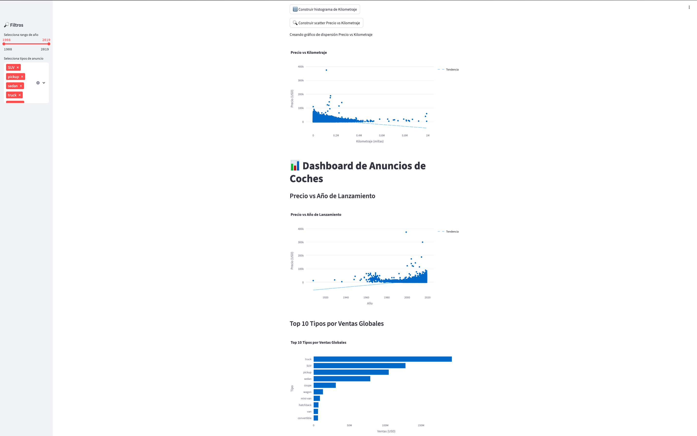

# Dashboard de Anuncios de Coches

## Descripción
Una aplicación web interactiva desarrollada en Python y Streamlit que permite explorar un conjunto de datos de anuncios de vehículos usados en Estados Unidos. Los usuarios pueden filtrar por año de fabricación y tipo de anuncio (SUV, sedan, truck, pickup) y generar gráficos dinámicos:

- Histograma de kilometraje  
- Diagrama de dispersión Precio vs Kilometraje  
- Gráfico de Precio vs Año de lanzamiento  

## Demo en Vivo
La aplicación está desplegada en Render y accesible desde cualquier navegador:

https://dashboard-autos-bxh8.onrender.com/

## Instalación Local
1. Clona el repositorio:
   git clone https://github.com/LisethHC02/project-sprint-7.git
   cd project-sprint-7
   
python -m venv venv
source venv/bin/activate      # macOS/Linux

pip install -r requirements.txt
streamlit run app.py
## Uso
Ajusta el rango de años y selecciona los tipos de anuncio en el panel lateral.

Haz clic en los botones para generar cada gráfico.

## Capturas de Pantalla

  
  
  
  

## Estructura de Archivos
project-sprint-7/
├─ app.py
├─ requirements.txt
├─ vehicles_us.csv
├─ screenshots/
│  ├─ dashboard_full.png
│  ├─ filtros.png
│  ├─ histograma_kilometraje.png
│  ├─ precio_vs_kilometraje.png
│  └─ tipos_de_anuncios.png
└─ README.md
